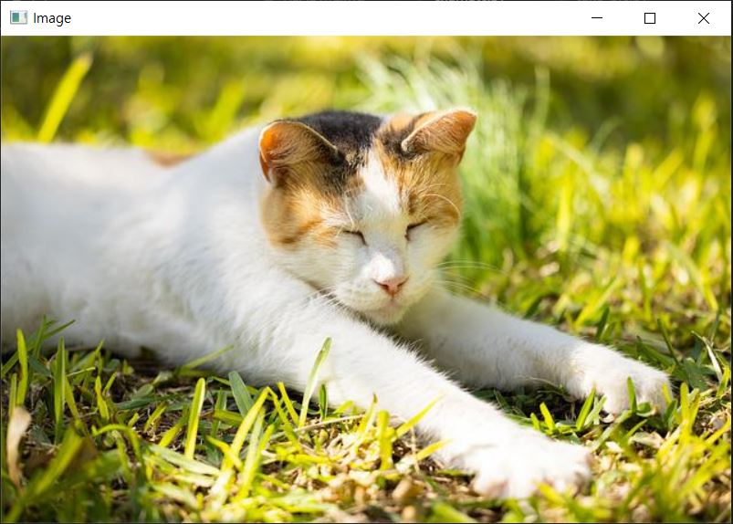

## Getting Start
1. [OpenCV 설치](#opencv-설치)
2. [예제 코드 테스트](#예제-코드-테스트)

---

## OpenCV 설치
1. Python 설치 (3.X 버젼 필요)
(https://www.python.org/downloads/)

2. OpenCV에 필요한 Python 라이브러리 및 패키지 설치
```
pip install numpy 
pip install matplotlib
pip install cvzone
pip install schedule
```
* `numpy` : 행렬이나 일반적으로 대규모 다차원 배열을 쉽게 처리할 수 있도록 지원합니다.
* `matplotlib` : Tkinter , wxPython , Qt 또는 GTK 와 같은 범용 GUI 툴킷을 사용하여 애플리케이션에 플롯을 포함 하기 위한 객체 지향 API를 제공합니다.
* `cvzone` : 이미지 처리와 AI 기능을 쉽게 실행할 수 있는 컴퓨터 Vision Package입니다. OpenCV, Mediapipe 라이브러리를 사용합니다.
* `schedule` : 정해진 시간에 Python Script를 자동 실행하는, 작업 예약용 라이브러리입니다.

3. OpenCV 라이브러리 설치
```
pip install opencv-python
```

4. OpenCV 설치 확인
```py
import cv2 as cv
print(cv.__version__)
```
* OpenCV 버젼이 화면에 출력되면 정상적으로 설치가 완료된 것입니다.

## 예제 코드 테스트
* 입력 코드
```py
import cv2

img = cv2.imread('cat.jpg')

cv2.imshow("Image", img)
cv2.waitKey(0)
cv2.destroyAllWindows()
```
* 결과


